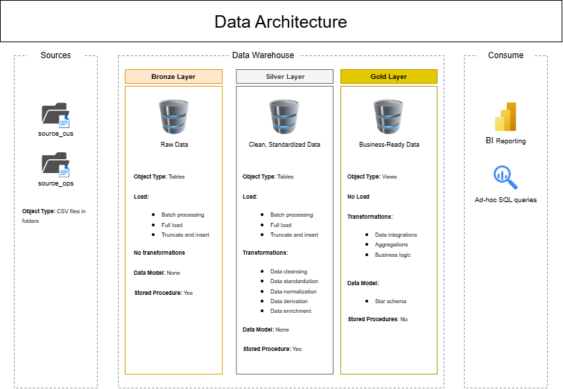
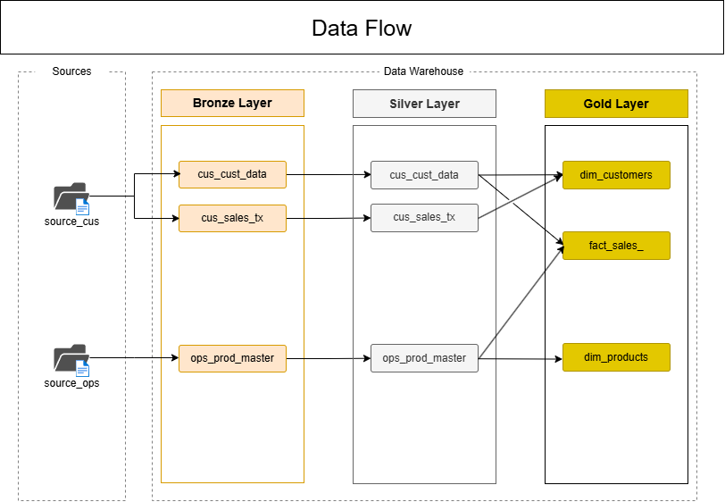

# Tech Office Retail Data Warehouse Project

This project simulates the design and implementation of a data warehouse for a fictional online domestic technology and office supply retailer. Using the Medallion Architecture (Bronze, Silver, Gold layers), I demonstrate how to ingest, clean, and model transactional data to support business insights using SQL Server 2022.

## Business Goal

The objective is to support decision-making for sales performance, customer segmentation, product trends, and market targeting. The objectives include:

- Identifying high-value segments
- Identifying top-selling products
- Identifying states or regions that have the highest order volume

By structuring raw transaction data into a dimensional model, business users can easily analyze KPIs such as total sales and regional performance.

## Tools Used

- SQL Server 2022
- T-SQL for ETL and view creation
- Excel for data exploration and simulation
- Git for version control

## Data Architecture

The data pipeline follows a multi-layered approach using the medallion architecture:

- **Bronze Layer**: CSV files ingested into staging tables without transformation.
- **Silver Layer**: Cleaned and transformed data with standardized formatting and deduplicated records.
- **Gold Layer**: Final dimensional model with star schema (fact and dimension views) for business intelligence reporting.

## Dataset

The synthetic dataset was generated by ChatGPT+ and simulates 105,000 transactions across multiple orders, customers, products, and regions. Contains nulls, typos, duplicates, and formatting issues to reflect real-world data cleaning challenges.

## ETL Workflow

1. **Bronze Layer**:
    - Created raw staging tables under the `bronze` schema to store unprocessed customer, sales, shipping, and product data derived from CSV files
    - Dropped existing tables to ensure repeatability and ease of re-running the setup
    - Created three tables for customer demographics, sales transactions, product information, and shipping information
    - Created a **stored procedure** to truncate existing data and load CSV files using bulk insert
2. **Silver Layer**:
    - Removed duplicates and nulls using filters and window functions
    - Standardized categorical values (e.g., 'state', 'segment') by applying string cleaning and formatting operations
    - Added metadata fields for audibility
3. **Gold Layer**:
    - Create fact and dimension views to model the data in a star schema format
    - Added key measures for sales transactions
    - Views support common business questions (e.g. net sales by region, top 5 products, etc.)

Each layer was created with modular scripts to enable reproducibility.

## Repository Structure

- /datasets/     &rarr; CSV files
- /docs/         &rarr; ERD diagrams
- /scripts/      &rarr; SQL scripts initializing the database and for the `Bronze`, `Silver`, and `Gold` layers
- /tests/        &rarr; SQL scripts for silver and gold quality checks
- README.md      &rarr; Project documentation

## Key Learnings

- Expanded knowledge of data standardization in SQL using string functions and conditional logic
- Simulated realistic data anomalies to showcase cleaning skills
- Gained deeper understanding of star schema modeling and SQL-based analytics
